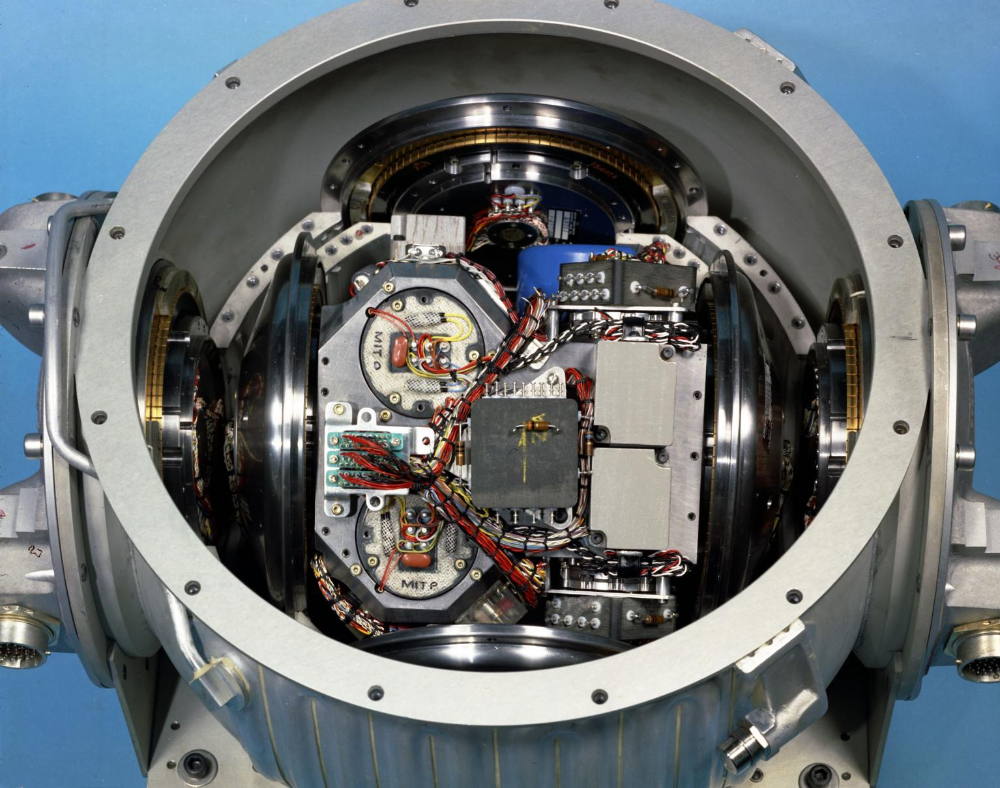
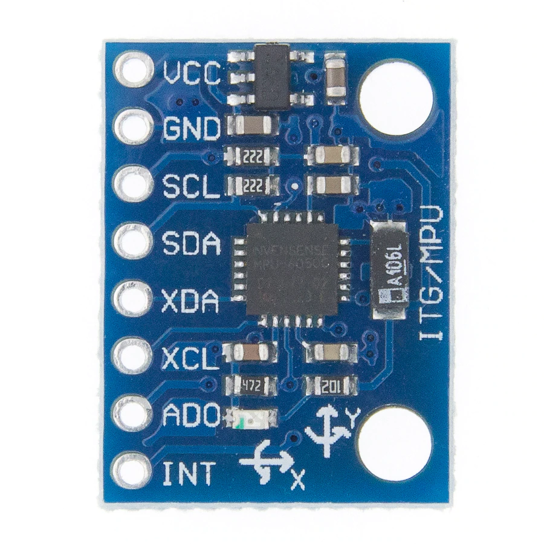
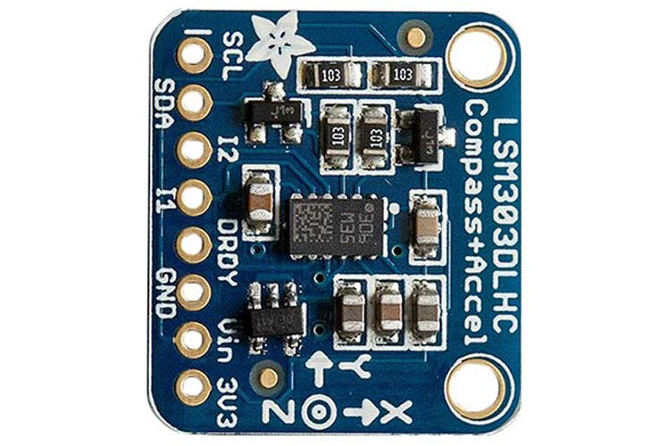
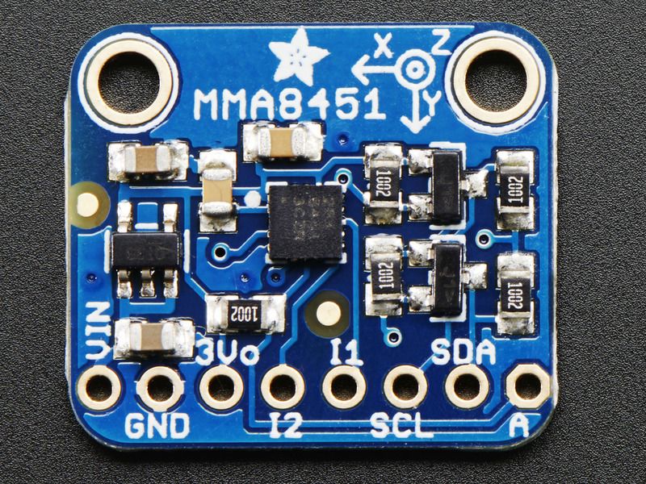

# Inertial Measurement Unit (IMU)

- The IMUs are navigational electronic devices comprising of accelerometers, gyroscopes, and sometimes magnetometers. [wikipedia](https://en.wikipedia.org/wiki/Inertial_measurement_unit)



## Applications

- Spacecrafts
- Airplanes
- Submarines
- Satellites
- UAVs
- Smartphones (e.g changing screen orientation by tilting the phone)

## Working Mechanism - ([https://www.arrow.com/](https://www.arrow.com/en/research-and-events/articles/imu-principles-and-applications#:~:text=How%20Does%20an%20IMU%20Work,magnetic%20fields%20surrounding%20the%20device.&text=IMUs%20combine%20input%20from%20several,order%20to%20accurately%20output%20movement.))

IMUs can measure a variety of factors, including speed, direction, acceleration, specific force, angular rate, and (in the presence of a magnetometer), magnetic fields surrounding the device.

### Each tool in an IMU is used to capture different data types:

- #### Accelerometer: 
	- measures velocity and acceleration

- #### Gyroscope: 
	- measures rotation and rotational rate

- #### Magnetometer: 
	- establishes cardinal direction (directional heading)

IMUs combine input from several different sensor types in order to accurately output movement.

## Today's activity!

- ### Experiment with IMU chips
	- #### GY-521 (ITG/MPU)
		
	- #### LSM303DLHC
		
	- #### MMA8451
		
- ### Program the chips with Arduino
- ### Generate csv data from the chips
- ### Plot csv data in excel

## Arduino libraries required

- #### "Adafruit MPU6050" (with depedencies), for the GY-521 chip
- #### "Adafruit LSM303DLHC", for the LSM303DLHC chip
- #### "Adafruit MMA8451", for the MMA8451 chip

## Wiring instructions

#### All chips are I2C. So, only 4 wires (+5V, GND, SDA, SCL) are used.

- #### VCC/Vin --> Arduino +5V
- #### GND --> Arduino GND
- #### SDA --> Arduino SDA (pin A4 on UNO)
- #### SCL --> Arduino SCL (pin A5 on UNO)

## Generating csv data (accelerometer only for simplicity) 

```c
void setup() {

//put your CSV headers here, so they are written once.
// example: timestamp, x, y, z

}

void loop() {
// create a comma-separated string with x, y, and z acceleration values in m/s2 and use the built-in millis() function as a timestamp
}
```
Then copy the output of the serial monitor to a file and save the file with a .csv extension.
Then load the csv file into excel and plot the data.


